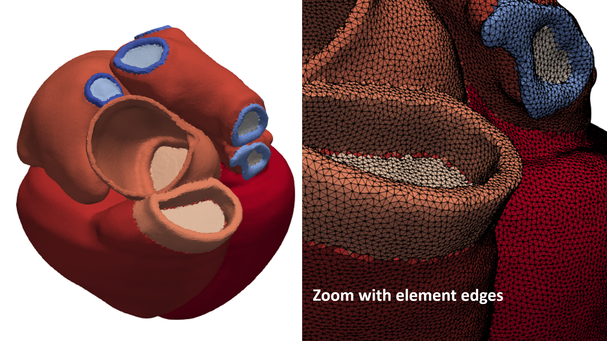
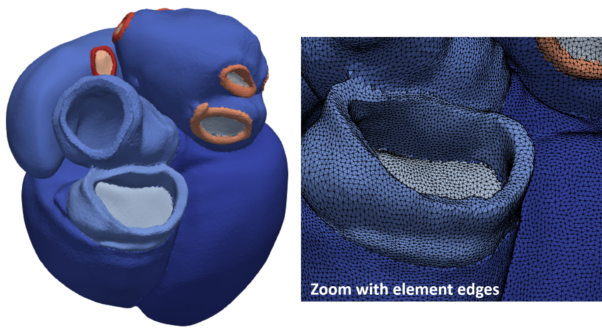
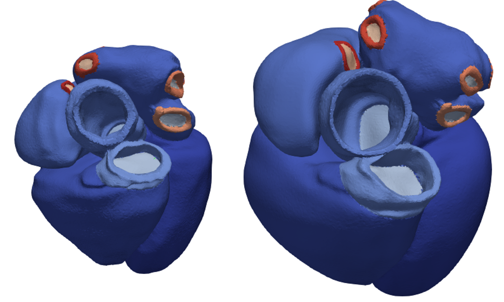

# Generation of detailed 3D cardiac meshes for electromechanical simulations
The heart adapts to physiological and pathological changes in loading. This can cause the heart to change size and shape. These changes can in turn have significant impact
on cardiac function. However, it is not clear if large changes in function are caused by large changes in shape or can smaller changes also be important. Biophysical
computational models of the heart provide a quantitative framework for mapping changes in anatomy to whole heart function. We created a publicly available healthy
four-chamber heart virtual cohort from clinical images. Each patient's heart anatomy in the virtual cohorts was described by the contribution of different components of heart
shape. The shape components are ranked by the amount of shape variance that they explain. Simulations of cardiac electrical activation and mechanical pump function in
hearts with shapes describe by different combinations of shape components were performed. This allowed us to show that some shape components that explain a large
amount of electrical and mechanical function variance only explain a small amount of anatomical variance. This highlights the need to have high fidelity anatomical models in
cardiac simulations and demonstrates that subtle changes in cardiac anatomy can have a large impact on cardiac function.

The codebase provides a set of methods for mesh generation, 3D alignment for atlas generation, tetrahedralisation of the
surface meshes with gmsh, rigid mesh manipulation, deformation and file management. 

*The project is an element of the framework used for statistical shape analysis of tetrahedral meshes, which allows for 
studies of cardiac shape, function and statistical reasoning.*

## The heart model
Briefly, we segmented four-chamber hearts from CT images using an automatic segmentation step with post-processing using Seg3D. The final segmentation consisted of 31
different labels for the blood pools, myocardium and the outflow tracts of the main vessels as well as the papillary muscles. The cardiac valves were modelled as surfaces
between the blood pools of the chambers. Similar surfaces were also added to the vessel locations to close the endocardial surfaces. We built unstructured tetrahedral meshes of
all elements except the blood pools and papillary muscles using the Computational Geometry Algorithm Library (CGAL) with average edge length of 1 mm. One of
the main differences of our meshes with respect to other whole-heart meshes, is the addition of auxiliary anatomical components needed to add mechanics boundary
conditions.

We have made all the [meshes from the CT](https://doi.org/10.5281/zenodo.4590294) and
 [synthetic cohort](https://doi.org/10.5281/zenodo.4593739) available for the
community in .vtk format. We
have added [1000 more meshes](https://doi.org/10.5281/zenodo.4506930) modifying the PCA weights randomly withing 2 SD
range. The same anatomical structures are present in all the meshes
described, but fibres and UVC were not included in the extra 1000 batch.
A VTK file for each mesh was included (in ASCII) as an UNSTRUCTURED GRID. In all
the cases the following fields were included: POINTS, with the coordinates of the points
in mm; CELL TYPES, having all of the points the value 10 since they are tetrahedra;
CELLS, with the indices of the vertices of every element; and CELL DATA corresponding
to the meshing tags.

---
# Screenshots
### Original model

### Synthetic model

### Extremes along one of the shape modes

---
# Credits
Please quote the following publication:
Cristobal Rodero, Maciej Marciniak, Marina Strocchi, Stefano Longobardi, John Whitaker, Mark D. O'Neill, Karli Gillette,
Christoph Augustin, Gernot Plank, Ed Vigmond, Pablo Lamata, Steven A. Niederer. (2021) *Linking statistical shape models and simulated function in
the healthy adult human heart.* DOI: https://doi.org/10.1371/journal.pcbi.1008851

---
# License
The code is openly available. If this tool has been useful in your research, please reference this site: 
https://github.com/MaciejPMarciniak/CardiacShapeModel
